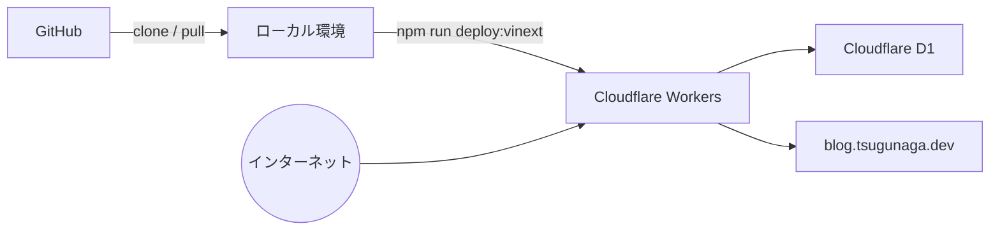

# tsugunaga.dev

音楽・未経験エンジニアとしての学習記録・ネット活動を発信する個人ブログ兼ポートフォリオサイトです。

**🔗 公開URL: [https://blog.tsugunaga.dev](https://blog.tsugunaga.dev)**

Cloudflare WorkersでNext.jsを動かし、問い合わせ内容と閲覧数はCloudflare D1に保存します。自宅PCやVMを起動しておく必要はありません。

## 構成



## 技術スタック

| レイヤー | 技術 |
|---|---|
| フロントエンド | Next.js (App Router) / TypeScript / Tailwind CSS |
| バックエンド | Next.js Server Actions / vinext |
| データベース | Cloudflare D1 |
| インフラ | Cloudflare Workers |
| 公開 | Cloudflare Workers Route |

## 機能

- ブログ記事一覧・詳細(カテゴリ: 音楽 / 学習記録 / ネット活動)
- カテゴリ別フィルタリング
- お問い合わせフォーム(D1に保存)
- 記事の閲覧数カウンター(DBでリアルタイム集計)

## ローカルでの開発

```bash
npm install
npm run db:migrate:local
npm run dev:vinext
```

ローカルD1はWranglerが自動的に管理します。

## デプロイ

最初にD1データベースを作成し、`wrangler.jsonc`の`database_id`を更新します。

```bash
npx wrangler d1 create my-blog-db
npm run db:migrate:remote
npm run deploy:vinext
```

`wrangler.jsonc`では、既存のCloudflareプロキシDNSを残したまま
`blog.tsugunaga.dev/*`をWorkers Routeへ割り当てています。通常の更新は
次のコマンドだけで反映できます。

```bash
npm run deploy:vinext
```
