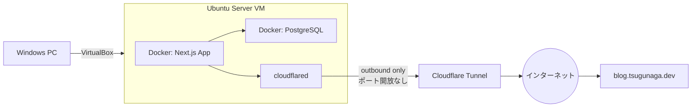

# tsugunaga.dev

音楽・未経験エンジニアとしての学習記録・ネット活動を発信する個人ブログ兼ポートフォリオサイトです。

**🔗 公開URL: [https://blog.tsugunaga.dev](https://blog.tsugunaga.dev)**

自宅のVirtualBox上に立てたUbuntu ServerでDockerコンテナとして動かしており、Cloudflare Tunnelを使うことでルーターのポート開放を一切行わずにインターネット公開しています。

## 構成



## 技術スタック

| レイヤー | 技術 |
|---|---|
| フロントエンド | Next.js (App Router) / TypeScript / Tailwind CSS |
| バックエンド | Next.js Server Actions / Prisma 7 (driver adapter) |
| データベース | PostgreSQL 16 |
| インフラ | Docker / Docker Compose / Ubuntu Server 26.04 LTS(VirtualBox) |
| 公開 | Cloudflare Tunnel(ポート開放不要) |

## 機能

- ブログ記事一覧・詳細(カテゴリ: 音楽 / 学習記録 / ネット活動)
- カテゴリ別フィルタリング
- お問い合わせフォーム(PostgreSQLに保存)
- 記事の閲覧数カウンター(DBでリアルタイム集計)

## ローカルでの開発

```bash
npm install
npx prisma generate
npm run dev
```

`.env.example` を参考に `.env` を用意し、ローカルのPostgreSQLに接続してください。

## デプロイ

Ubuntu Server上でDocker Composeを使って以下のように更新します(`deploy.sh` にまとめてあります)。

```bash
git pull
docker compose build
docker compose run --rm migrate
docker compose up -d app
```

自動復帰(`restart: unless-stopped`)、日次バックアップ、VM自動起動などの運用面も整備済みです。
